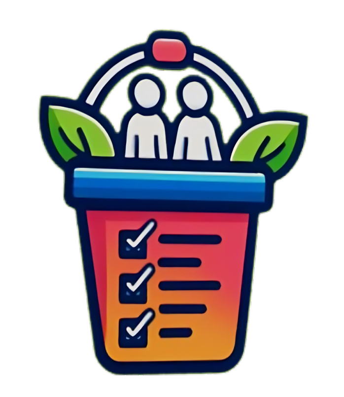

# My Bucker Pal application



## Overview
This bucket list app lets you easily store and organize your dream goals, whether they're personal ambitions or shared experiences. Explore a vast collection of ideas from other users to discover new adventures you hadn’t considered. If something catches your eye, you can express interest or join others in pursuing that goal. Likewise, you can invite friends or connect with like-minded individuals to collaborate on fulfilling your own bucket list items. With a user-friendly interface and a community-driven approach, this app transforms your aspirations into actionable plans, helping you achieve your dreams while sharing the journey with others.This is a basic chat application. The purpose to create this project to understand how to work websocket connection. This application simulated how a real chat application  work. After registration, you able to logging into the application. After that you can easily keep in touch with your friends, you should only know your friends name to create a private chat channel. You don't have to worry about losing your old messages, because all messages are saved in a database. If you want, you can add reactions (emoticons) to each message to help express yourself more easily.

## Table of Contents

- [Overview](#overview)
- [Build With](#build-with)
- [Installation](#installation)
- [Usage](#usage)
- [Features](#features)


## Built With


## Installation

Repo: https://github.com/MyBucketPal/MyBucketPal

## Prerequisites:

### Node.js and npm
- Ensure that Node.js (which includes npm) is installed on your machine. You can download and install it from the [official Node.js website](https://nodejs.org/).

  ```bash
  # To check if Node.js and npm are installed and view their versions, run:
  node -v
  npm -v
  ```

### .NET SDK
- Install the .NET SDK to build and run the ASP.NET Core backend. You can download it from the [.NET SDK download page](https://dotnet.microsoft.com/download).

  ```bash
  # To check if the .NET SDK is installed and view its version, run:
  dotnet --version
  ```
 
## Backend:

### 1. Navigate to the Backend Directory
Go to the Backend directory from the root folder.

```bash
cd Backend
```

### 2. Install Backend Dependencies
Restore the dependencies for your ASP.NET Core project.

```bash
dotnet restore
```

### 3. Build the Backend
Build your ASP.NET Core backend project.

```bash
dotnet build
```

### 4. Run the Backend
Run your ASP.NET Core backend project.

```bash
dotnet run
```

## Frontend:

### 1. Navigate to the Frontend Directory
Go to the Frontend directory from the root folder.

```bash
cd Frontend
```

### 2. Install Frontend Dependencies
Install the required npm packages for your Vite React project.

```bash
npm install
```

### 3. Run the Frontend Development Server
Start the Vite development server for your React frontend.

```bash
npm run dev
```

### 4. Access the Frontend
Once the development server is running, you can access your frontend by navigating to the URL displayed in your terminal, usually [http://localhost:5173](http://localhost:5173) or a similar port.

## Usage

To use the app, start by registering—only users aged 18 and over can sign up. After registering, log in to access your account. A basic account lets you browse and join others' bucket list ideas, but you cannot host your own. To unlock full features, including the ability to allow others to join your ideas, you can upgrade to a premium membership. Premium users can create and manage their own shared experiences, making it easier to collaborate with others on your journey toward achieving your goals.


## Features

Registration:
Log in:

Pages:
+ Home
+ MyIdeas(private/public)
+ Joining page
+ Successes - photos

## Future features

+ Show statistics
+ Dark mode
+ Calendar


